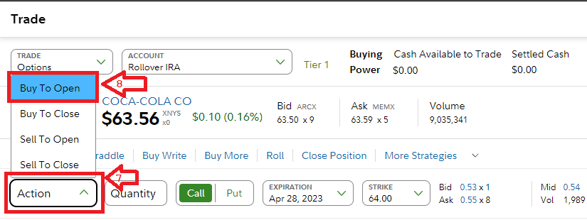
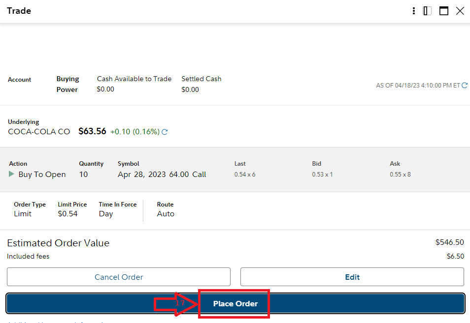

Log in to Fidelity and select the "Trade" menu.

-----
A small window should appear. Select the "Trade" style as "Options".

-----
Select the account to make the purchase under, type the name of a symbol, and select the matching company from the dropdown.

-----
For most purchases, the "Action" will be "Buy to Open". The opposite of "Buy to Open" is "Sell to Close", when needed to sell as position.

-----
Select the quantity desired to purchase. Toggle "Call" for stocks trending positively, "Put" for stocks trending negatively.

-----
Select the desired expiration. Keep in mind that expirations closer to the current day will have higher risk. Profit Decay is also greater on expirations closer to the current day.

-----
Select the "Strike", which is the price anticipated that the stock will trade at expiration.

-----
Select the price that will be desirable to the open market for sale. A "Limit" is the highest amount the broker will sell a stock.
It is safe to assume that the market will be unlikely to sell at "Bid", while also being highly likely to sell at "Ask". Adjusting the price around "Midpoint" increases likelihood of a successful transaction.

-----
Place an order!

-----